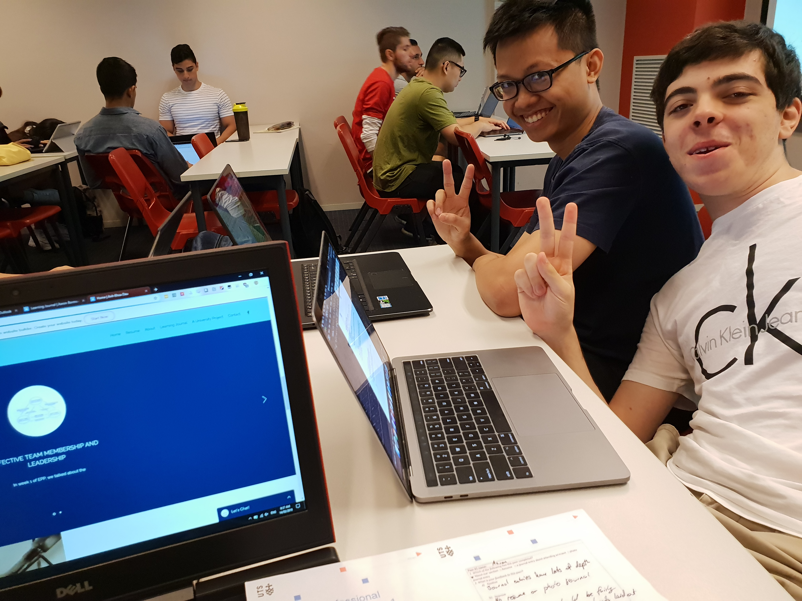

# Learning Journal

### List of Entries
>- [Careers Fair](./learnJournal.md#careers-fair)
>- [Professional Assessment Activity 1](./learnJournal.md#professional-assessment-activity-1)
>- [Professional Assessment Activity 2](./learnJournal.md#professional-assessment-activity-2)
>- [Elective Learning Journals](./learnJournal.md#elective-journal-entries)
    >- [Entry 1](./learnJournal.md#entry-1)
    >- [Entry 2](./learnJournal.md#entry-2)
    >- [Entry 3 - Critical Incident Summary](./learnJournal.md#entry-3)

## Careers Fair
08/02/19

In order to learn more about the career paths available to me I attended one of the STEM Careers Fairs organised by UTS Careers in Building 1.
As this event was more focused on pathways for students nearing graduation, I used it as a way to find out what companies were employing young engineers, as well as what sort of engineers they were looking to employ (in terms of technical background, as well as experience and personality).

I also collected some information booklets and brochures from the businesses attending, however very few of the companies were looking for my skillset, and even fewer still were looking to talk to someone with so many years left in their degree (one of the representatives literally tutted at me and proceeded to ignore me).

Although I was unsuccessful in finding any industry contacts, I still found the event useful as it helped me to find out what positions existed within the industry, and the types of companies that were hiring. it also gave me insight into the sorts of tasks that engineers perform as part of their roles, such as System Admins deploying virtual machines for their clients.

Comment on social media:
Although social media is prevalent throughout the industry, and has its place in networking with contacts and potential employers, there is a risk associated with putting yourself out there. This can include disqualification form job applications due to offensive or inappropriate posts, coworkers finding information you would prefer to keep secret, or your boss seeing every time you've complained about them or your job. Social media is a powerful tool if used correctly, however care and consideration must be taken in choosing what you post, and who can see what you post.

## Professional Assessment Activity 1
15/02/19

The purpose of Professional Assessment Activity 1 is to allow students to practice giving and receiving feedback, as well as allowing them to checkpoint their progress on their ePortfolios. In our activity group members went in order receiving feedback from other group members, demonstrating what they thought could be improved upon on the actual ePortfolio where possible.

I feel that this was an extremely beneficial task for the most part, as people tend to fixate on smaller things within the task at hand, which can cause them to miss out or neglect other areas. This tunnel vision can be countered by a fresh set of eyes that do not have any prior exposure to the work that has been done. This is especially important in assessment tasks, as failure to include all necessary sections can result in significant mark loss.

While taking on feedback can be difficult, especially if both parties are not on the same page about what is expected, it is important that both parties are able to come to some form of agreement as to the severity of the problem raised, and what a viable solution would be. I attempted to achieve this in the group activity by using the Positive-Improve-Positive or "Feedback Sandwich" method, as described in Feedback Sandwich (Bow Valley College, 2013), however this did not entirely stop disagreements from occurring. I feel that these difficulties came fom a differing understanding of what was expected of us for the assessment.

I feel that in order to maximise what everyone gets out of this activity it is best that everyone has defined what they believe to be important for the assessment/ePortfolio in terms of content and quality, with the group coming to some form of consensus on this as an overall marking baseline. Additionally team members should make their ePortfolios available as early as possible in order for proper time and consideration to be given for each ePortfolio. These are things that I will discuss with my group mates when we next meet.

[Assessment Activity Worksheet](./assets/prof_asses_1.pdf)

Bow Valley College 2013, Feedback Sandwich, videorecording, Youtube, viewed 02 February 2019, <https://www.youtube.com/watch?v=NO34pZvCg_s>

## Professional Assessment Activity 2

## Elective Journal Entries

### Entry 1
01/02/19

Week one was spent familiarising myself with the subject and what is expected throughout. It also included learning about the other members of my activity group, which I feel is important as it is our group members who will be giving feedback and constructive criticism on our resumes before assessments, and as such understanding their background and what they expect to get out of the subject is important as it shapes what responses they will give you on your work. Additionally it allows you to shape any feedback you have to give to them, in order for it to not be taken in the wrong way. I found the idea of the different types of capital to be interesting as the majority of people tend to think about what they believe they are worth, and what a company or job can do for them. While this is important, what you bring to the company and what the company believes you are worth are more important (human capital), as the company is the one who gets to decide who is hired and who is not. An individual must use their access to the other types of capital to help improve their percieved worth to a company (i.e. cultural capital can be slightly improved through the way that you dress, carry yourself, and interact with others), or to help gain opportunities that they may not have otherwise (i.e. social capital and your professional and personal networks can be used to find out about roles that may not be promoted as being vacant or hiring).

These different types of capital all play into the development of an "engineering identity", falling under the umbrella of "navigating the formal and informal pathways into the profession", as described in Schell, W. & Hughes, B. 2017. This does however show that while the different types of capital are important to an engineer's career, especially in terms of finding employment, they are not the be all and end all of an engineer's personal development. An engineer should aim to be continually developing not just their capital, but their engineering identity as a whole, whether that be from learning new things, learning about opportunities within the field, or by gaining recognition from their peers.

### Entry 2

### Entry 3 - Critical Incident Summary
22/02/19

At the factory a close family member works at there was a severe safety incident in which a contractor unfortunately lost his life and another two people were injured.

The contractors arrived on site to perform maintenance and cleaning on an industrial mixer. Before commencing work the contractors checked with staff on site to ensure that the equipment was correctly locked and tagged out in accordance with standard operating procedures in the event of maintenance needing to be performed. One of the on site technicians assured them that the equipment was disabled, however this was not actually the case. Although it is not yet entirely clear as to where negligence occured, it quickly became evident that the electrical supply to the mixer had not been disconnected and tagged out. This particular mixer was fitted with a system that automatically started operation of the system once weight was detected inside the mixer (with the assumption being that something to be mixed had been added to the system). This meant that when that one of the contractors entered the mixer to begin maintenance, the mixing blades began to spin, severely injuring the first contractor. The second contractor then climbed into the mixer in order to assist the first contractor. This resulted in the second contractor also sustaining injuries, while the first passed away due to his injuries. The third contractor then attempted to pull the other two contractors out, and was dragged into the mixer, resulting in him also sustaining injuries. The machine was only stopped when a staff member who worked with the mixer pressed the emergency stop. The contractors were only able to be removed from the mixer once emergency services arrived on site.

Critical Incident Questions:
Who are the participants?
Members of staff from the company, the contractors, emergency services.

What was critical about this incident?
This incident was critical due to the loss of life, serious injury, and failing of safety protocols and how we can learn to prevent things like this from occuring in the workplace.

How was the confidentiality of the participants protected?
Although this incident was highly publicised at the time of occurance, with the events that unfolded and names of those involved being public knowledge, in this summary no names of companies, individuals, or specifics as to the type of work occuring at the factory were used. This is important as to the best of my knowledge the results of the SafeWork inquiry have not yet been published.

What can be learned from this critical incident? Why is it significant?
The main point that can be learned from this critical incident is to not take shortcuts and make assumptions with safety. Although trusting others and what they say is important, it is much better to come off as slightly rude and be safe, rather than be involved in an event such as this.
In this case this could have been achieved by the contractors inspecting the system to ensure that it was correctly disabled.
Another factor in this incident was that neither the second or third contractor knew of the location and operation of the emergency stop system, which is why it took so long for the system to be stopped, and why all three of the contractors ended up being injured.
This is significant as as an engineer there is the potential for you to be involved in the safe operation of equipment, and in the safety sign-off process. This involves the correct procedures and methods to be followed, as well as the familiarisation of appropriate safety and rescue technologies.

An understanding of safety in the workplace, and why it is to be followed is extremely important as events such as these affect more than just those directly involved, but their families and coworkers.